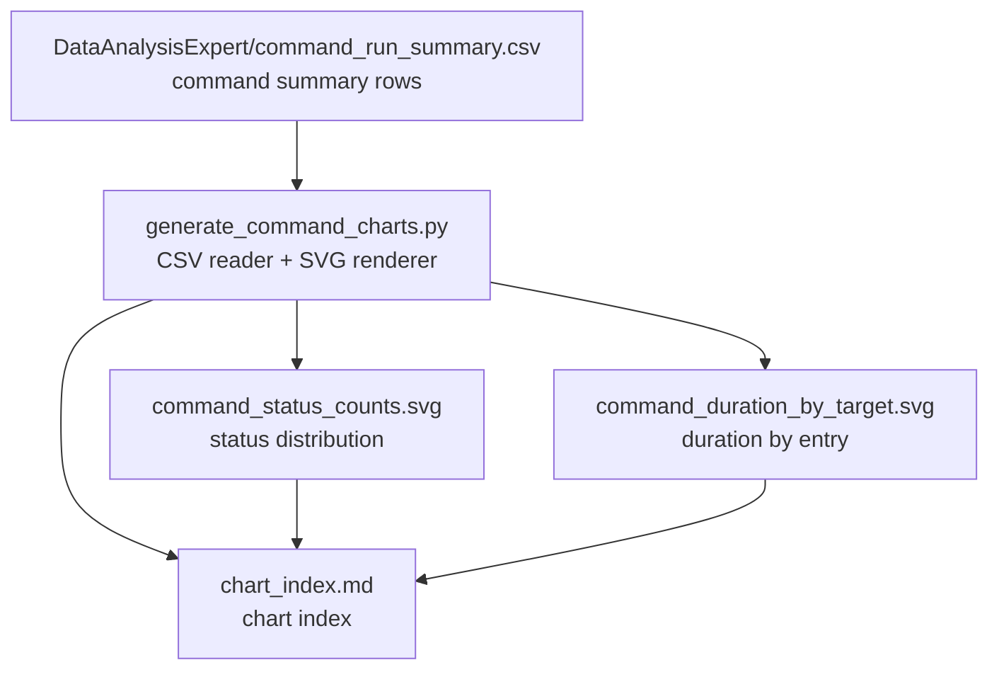

# Command Chart Index

This index ties the summary CSV to the generated SVG charts.

- Total commands: 16
- Pass: 16
- Fail: 0
- Timeout: 0

## Dataset
- Label: command

## Chart Pipeline

## Generated Graph Files
- command_status_counts.svg
- command_duration_by_target.svg

## Source
- DataAnalysisExpert/command_run_summary.csv
