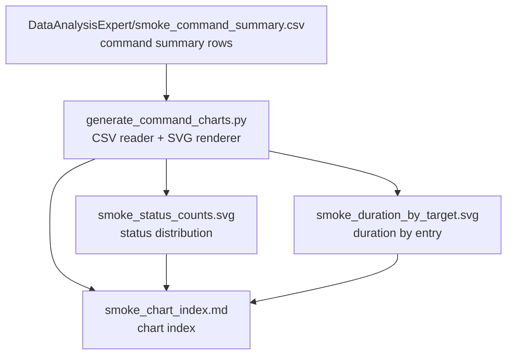

# Command Chart Index

This index ties the summary CSV to the generated SVG charts.

- Total commands: 11
- Pass: 11
- Fail: 0
- Timeout: 0

## Dataset
- Label: smoke

## Chart Pipeline

## Generated Graph Files
- smoke_status_counts.svg
- smoke_duration_by_target.svg

## Source
- DataAnalysisExpert/smoke_command_summary.csv
