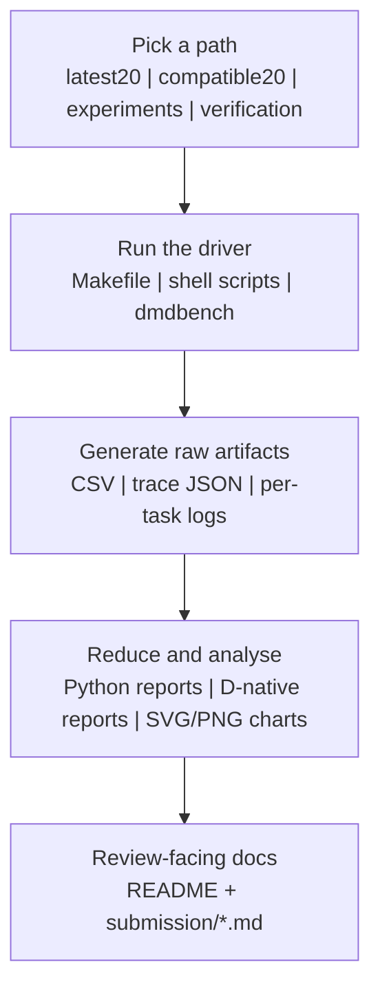
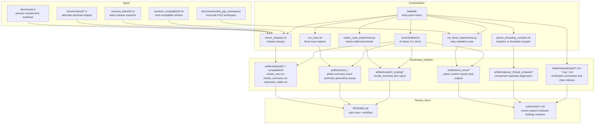

# DMD Regression Prototype (Dennis 2026 Alignment)

This repository is a D-first compiler-benchmark prototype for DMD. It measures release-to-release compile behaviour, attributes compile cost with `-ftime-trace`, runs targeted experiments, and packages the output into review-ready evidence.

The project uses a dual-track workflow:

- `latest20`: a literal "latest ~20 releases" window from `downloads.dlang.org`
- `compatible20`: a host-compatible release window for stable regression scoring on this macOS arm64 machine

## Why The Repo Uses Two Tracks

Dennis asked for literal latest-release evidence and concrete regression findings. On this host, those goals conflict if they are forced into one dataset.

- `latest20` keeps compatibility reality visible, including failures.
- `compatible20` keeps the timing dataset stable enough for meaningful regression analysis.

## Quick Workflow

This repo has one simple loop:

1. pick the release window or experiment path,
2. run the benchmark or experiment,
3. generate CSVs, charts, and Markdown reports,
4. fold the strongest evidence into the submission docs.



## Codebase At A Glance

The repository is organized into four layers:

- D workloads:
  - `benchmark.d` is the primary compile-time workload.
  - `benchmarks/d/ctfe.d`, `benchmarks/d/mixed.d`, `benchmarks/d/semantics.d`, and `benchmarks/d/templates.d` provide alternate benchmark shapes.
  - `benchmarks/dub_pgo_workspace/` is a local multi-package D workspace used for `dub`/PGO experiments.
- Shell orchestration:
  - `bench_releases.sh`, `run_trace.sh`, `linux_gap_close.sh`, `build_parser_threaded_dmd.sh`, and `parser_threading_compare.sh` drive reproducible end-to-end runs.
  - `Makefile` exposes standard entry points for common workflows.
- Python analysis:
  - `analyze_results.py` builds summary tables, regression tables, reports, and PNG plots.
  - `trace_phase.py` reduces `-ftime-trace` JSON into phase and event summaries.
  - `switch_case_experiment.py` and `not_done_experiments.py` run targeted idea-validation experiments.
- D-native CLI:
  - `tools/dmdbench` mirrors the core sweep, analyze, trace, switch-scale, and native not-done workflows in D.

## Technical Topology



## What The Project Produces

- Release-sweep raw data: `artifacts/latest20/results_raw.csv`, `artifacts/compatible20/results_raw.csv`
- Regression summaries: `artifacts/<track>/results_summary.csv`, `artifacts/<track>/regression_table.csv`, `artifacts/<track>/regression_table_advanced.csv`
- Multi-track consensus: `artifacts/regression_consensus_advanced.csv`, `artifacts/report_consensus.md`
- Trace outputs: `artifacts/trace.json`, `artifacts/trace_phase_summary.csv`, `artifacts/trace_event_summary.csv`, `artifacts/trace_granularity_sweep.csv`
- Experiment outputs: `artifacts/switch_scaling/*`, `artifacts/not_done/*`, `artifacts/parser_thread_compare/*`
- Command-matrix outputs: `DataAnalysisExpert/command_run_summary.csv`, `DataAnalysisExpert/manual_smoke_summary.csv`, and the generated SVG charts
- Mentor-facing docs: `submission/*.md`

## What The Project Is Used For

- Build reproducible release-history compile-time evidence for DMD.
- Separate host-compatibility reality from regression-quality timing analysis.
- Attribute compile-time cost by compiler phase with `-ftime-trace`.
- Validate targeted hypotheses such as switch-scaling behavior, parser-threading behavior, runtime-library kernels, and `dub`/PGO workflow gaps.
- Package the results into review-ready notes for mentors and upstream contributors.

## Language Composition Check

A local source snapshot, excluding `external/`, local toolchains, generated artifacts, and command-log outputs, currently looks like this:

- `D`: 11 files, 5,625 lines
- `Python`: 5 files, 5,625 lines
- `Shell`: 10 files, 1,777 lines
- `Markdown`: 10 files, 788 lines

Conclusion: the repository is still centered on D workloads and a D-native CLI, with Python and shell used for orchestration, analysis, and reporting.

## Verified Smoke Results (2026-03-20)

The current verification run covered both the D-native path and the shell/Python path.

- Benchmark compilation:
  - `benchmark.d` and every file in `benchmarks/d/*.d` now compile cleanly with DMD `v2.112.0`.
  - The local benchmark executable runs successfully and prints `rows=6653 aggregate=4230614`.
- `dub` verification:
  - `tools/dmdbench` builds successfully with workspace-local `dub`.
  - The checked-in `dub` workspace packages all pass `dub test` when `DUB_HOME=.tmp-dub-home` is set.
- Smoke verification summary:
  - `make verify-smoke` now writes `DataAnalysisExpert/smoke_command_summary.csv`.
  - The current smoke matrix records 11 command runs, all passing.
  - It covers release sweep smoke, analysis, trace, switch scaling, runtime-library kernels, cached `dub` PGO, delegated Linux workflows, and parser-threading checks.
- D-native CLI smoke summary:
  - `DataAnalysisExpert/manual_smoke_summary.csv` remains as a focused D-native/manual reference with 11 passing command runs.
  - Verified commands include `dmdbench analyze`, `dmdbench trace`, `dmdbench switch-scale`, `dmdbench not-done --list-tasks`, `dmdbench not-done --native`, and a compatible-track release sweep smoke run.
- Current compatible-track sweep smoke:
  - `artifacts/verification_20260320/bench_smoke/results_raw.csv` contains 20 successful `compatible20` rows.
  - Fastest release in the smoke run: `2.090.1` at `1867 ms`.
  - Slowest release in the smoke run: `2.096.0` at `5283 ms`.
- Trace smoke summary:
  - `artifacts/verification_20260320/run_trace/trace_phase_summary.csv` shows `semantic_analysis` as the top phase at `68.52%`, followed by `ctfe` at `19.27%`.
- Full verification matrix:
  - `make verify-full` now writes `DataAnalysisExpert/command_run_summary.csv`.
  - The current full matrix records 16 command runs, all passing.
  - Slowest command in the current full run on March 20, 2026: `broader-gist` at `693 s`.

## Current Chart And Graph Files

The current verification refresh generated these named chart files:

- `DataAnalysisExpert/command_status_counts.svg`
- `DataAnalysisExpert/command_duration_by_target.svg`
- `DataAnalysisExpert/full_status_counts.svg`
- `DataAnalysisExpert/full_duration_by_target.svg`
- `DataAnalysisExpert/smoke_status_counts.svg`
- `DataAnalysisExpert/smoke_duration_by_target.svg`
- `DataAnalysisExpert/manual_smoke_status_counts.svg`
- `DataAnalysisExpert/manual_smoke_duration_by_target.svg`
- `artifacts/verification_20260320/dmdbench_analyze/compile_time_trend.svg`
- `artifacts/verification_20260320/dmdbench_analyze/artifact_size_trend.svg`
- `artifacts/verification_20260320/run_trace/trace_phase_bar.png`
- `artifacts/verification_20260320/python_switch/compile_time_vs_cases.png`

The graph indexes are recorded in:

- `DataAnalysisExpert/chart_index.md`
- `DataAnalysisExpert/full_chart_index.md`
- `DataAnalysisExpert/smoke_chart_index.md`
- `DataAnalysisExpert/manual_smoke_chart_index.md`

## Verification Entry Points

The repository now exposes two verification tiers and one maintenance tier:

- `make verify-smoke`: fast local readiness checks with cached inputs and delegated CI summaries for Linux-only workflows
- `make verify-full`: broader command coverage with chart generation for the full matrix summary
- `TIMEOUT_SCALE=<n> make verify-full`: increase full-matrix ceilings when you want a longer local run without editing the script
- `make refresh-latest-snapshot`: refreshes `versions_latest20.txt` explicitly
- `make bootstrap-external-cache`: populates the release-archive cache and the cached `dlang/dub` source checkout for offline runs

Current verification summary files:

- Smoke summary: `DataAnalysisExpert/smoke_command_summary.csv`
- Full summary: `DataAnalysisExpert/command_run_summary.csv`
- Manual smoke reference: `DataAnalysisExpert/manual_smoke_summary.csv`

Current verification chart prefixes:

- Smoke charts: `DataAnalysisExpert/smoke_status_counts.svg`, `DataAnalysisExpert/smoke_duration_by_target.svg`
- Full charts: `DataAnalysisExpert/full_status_counts.svg`, `DataAnalysisExpert/full_duration_by_target.svg`
- Manual smoke charts: `DataAnalysisExpert/manual_smoke_status_counts.svg`, `DataAnalysisExpert/manual_smoke_duration_by_target.svg`

## Requirements

- macOS for the current local workflow, plus `bash`, `curl`, `tar`, and `python3`
- `matplotlib` if you want PNG plots from the Python path
- A local D toolchain such as `./.locald/dmd-nightly/osx/bin/dmd`
- For sandboxed or restricted environments, set a local `dub` home:

```bash
export DUB_HOME="$PWD/.tmp-dub-home"
mkdir -p "$DUB_HOME"
```

Recommended Python setup:

```bash
python3 -m venv .venv
./.venv/bin/pip install matplotlib
```

## Quick Start

```bash
# 1) Refresh the pinned latest snapshot only when you want to update it
make refresh-latest-snapshot

# 2) Bootstrap caches for offline release sweeps and dub PGO source
make bootstrap-external-cache

# 3) Run both tracks with the shell workflow
./bench_releases.sh --track both --latest-source snapshot --archive-source cache

# 4) Analyze both tracks with Python
./.venv/bin/python ./analyze_results.py \
  --input-dir artifacts \
  --tracks latest20,compatible20 \
  --out-dir artifacts

# 5) Install a workspace-local D toolchain if needed
curl -fsSL https://dlang.org/install.sh | bash -s -- -p ./.locald install dmd-nightly

# 6) Run trace attribution
./run_trace.sh \
  --python-bin ./.venv/bin/python \
  --dmd-bin ./.locald/dmd-nightly/osx/bin/dmd \
  --granularity 1 \
  --granularity-sweep 1,10,50,100

# 7) Run the switch-scaling experiment
./.venv/bin/python ./switch_case_experiment.py \
  --compiler ./.locald/dmd-nightly/osx/bin/dmd \
  --case-counts 100,1000,10000 \
  --runs 7 \
  --warmups 2 \
  --out-dir artifacts/switch_scaling

# 8) Run the broader not-done suite with the cached dub source
./.venv/bin/python ./not_done_experiments.py \
  --out-dir artifacts/not_done \
  --dub-upstream-source cached

# 9) Run the fast readiness matrix and charts
make verify-smoke

# 10) Run the broader matrix when you want more coverage
make verify-full
```

## D-First CLI (`dmdbench`)

The repository includes a D-native CLI that covers the core workflow.

```bash
export DUB_HOME="$PWD/.tmp-dub-home"
mkdir -p "$DUB_HOME"

# Build
(cd tools/dmdbench && ../../.locald/dmd-nightly/osx/bin/dub build)

# Sweep
./tools/dmdbench/bin/dmdbench sweep --track compatible20 --latest-source snapshot --archive-source cache

# Prepare caches only
./tools/dmdbench/bin/dmdbench sweep --track latest20 --latest-source snapshot --archive-source cache --prepare-cache-only

# Analyze
./tools/dmdbench/bin/dmdbench analyze \
  --input-dir artifacts \
  --tracks latest20,compatible20 \
  --out-dir artifacts

# Trace
./tools/dmdbench/bin/dmdbench trace \
  --dmd-bin ./.locald/dmd-nightly/osx/bin/dmd \
  --granularity 1 \
  --granularity-sweep 1,10,50,100

# Switch scaling
./tools/dmdbench/bin/dmdbench switch-scale \
  --compiler ./.locald/dmd-nightly/osx/bin/dmd \
  --case-counts 100,1000,10000

# Native not-done subset
./tools/dmdbench/bin/dmdbench not-done --list-tasks
./tools/dmdbench/bin/dmdbench not-done \
  --native \
  --tasks zero_cost,gc_kernels,aa_kernels,linker_strip,float_to_string_kernels,phobos_sections
```

Benchmark-suite selection for release sweeps is available through `--bench-suite core|ctfe|templates|semantics|mixed`.

## Important Method Notes

- Compile benchmarking uses `-c` mode so the metric focuses on compiler work instead of linker noise.
- Artifact size is compile-output object size, not final linked executable size.
- Regression flags remain intentionally conservative: percentage jump plus non-overlapping confidence intervals.
- The parser-prototype frontend change is preserved in `patches/external_dmd_parser_parallel_prototype.patch`, and the helper/CI path pins `external/dmd` to upstream commit `4faeee39cf33c1e3491b7e1da83a71111f05606f` before applying it.
- Linux-only workflows (`strict-perf-probe`, `linux-gap-close`) now return delegated CI pass summaries on non-Linux hosts instead of host-mismatch failures.
- `latest20` is snapshot-first by default. Normal runs use the pinned `versions_latest20.txt` file and only refresh when you explicitly request `--latest-source refresh` or `make refresh-latest-snapshot`.
- Release sweeps are cache-first by default. Normal runs use the local archive cache and only download archives during explicit bootstrap flows such as `make bootstrap-external-cache`.
- The `dub_pgo` workflow is cache-first by default and reuses `artifacts/cache/dub_pgo/dlang__dub` unless you explicitly bootstrap or point it at another checkout.
- The parser prototype has both `coarse` and `narrow` lock modes. `narrow` is the real split parse/commit path, but it is still performance-partial on this host.

## Extra Not-Done Artifacts

Running `not_done_experiments.py` writes:

- `artifacts/not_done/zero_cost_ldc/*`: `std.range/std.algorithm` vs `foreach` with `ldc2 -O3`
- `artifacts/not_done/libphobos_sections/*`: section-size sort for `libphobos2.a`
- `artifacts/not_done/linker_strip_unused_data/*`: linker dead-strip behavior
- `artifacts/not_done/c_vs_d_assembly/*`: `clang` vs `ldc2` assembly comparisons
- `artifacts/not_done/large_char_array_4gb/*`: `char[]` larger-than-4GB truncation probe
- `artifacts/not_done/compiler_fuzz/*`: random mutation fuzz runs over `dmd/compiler/test` seeds
- `artifacts/not_done/allocator_compare/*`: allocator swap comparison
- `artifacts/not_done/ast_field_order/*`: AST field-order experiment artifacts
- `artifacts/not_done/dmd_profile_compare/*`: `dmd -profile` comparison artifacts
- `artifacts/not_done/large_non_zero_init_structs/*`: non-zero-init struct scan results
- `artifacts/not_done/lexer_parser_parallel/*`: parser-threading prototype artifacts
- `artifacts/not_done/perfetto/*`: Perfetto capture helpers and outputs
- `artifacts/not_done/status.md`: checklist-style done/blocked summary
