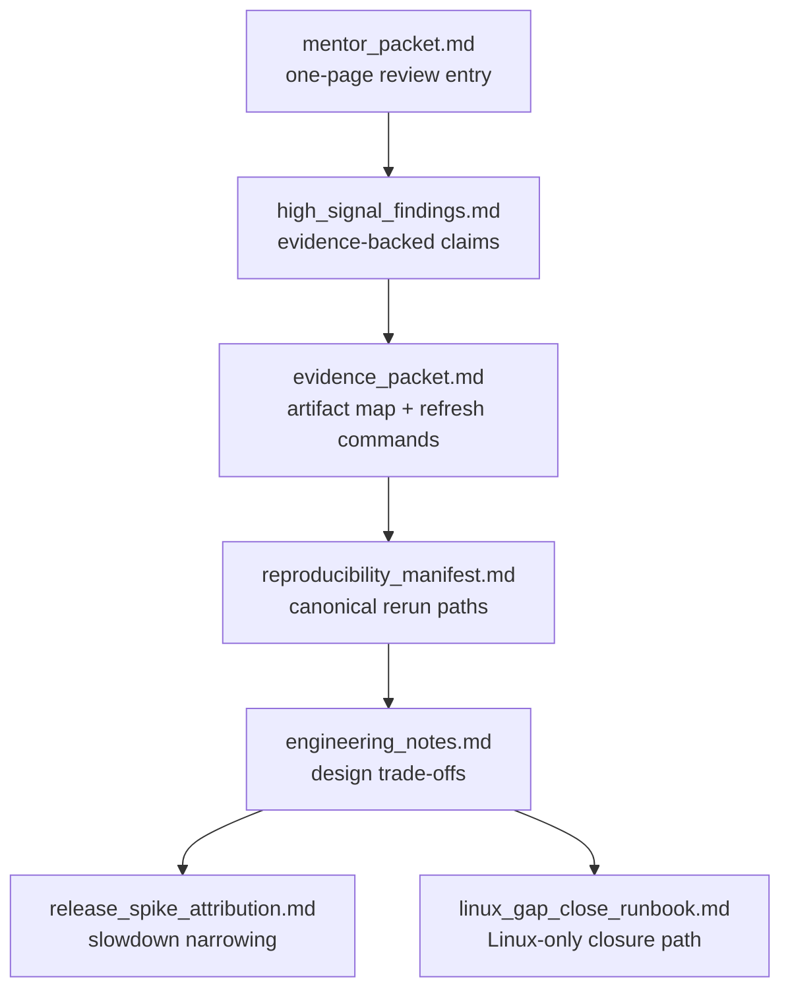

# Submission Folder Index

This folder holds the mentor-facing side of the repo. Read it as a guided packet: summary first, evidence next, then repro and follow-up notes.

- `mentor_packet.md`: A concise mentor-facing summary and a review checklist.
- `high_signal_findings.md`: Evidence-first findings extracted from the current artifact set.
- `release_spike_attribution.md`: Notes for the current release-window slowdown candidate.
- `reproducibility_manifest.md`: Environment notes, canonical commands, and verification entry points.
- `linux_gap_close_runbook.md`: Linux-only workflow notes for closing the remaining `perf` and parser gaps.
- `engineering_notes.md`: Design tradeoffs, constraints, and rationale.
- `evidence_packet.md`: A curated map of the most important artifacts and refresh commands.
