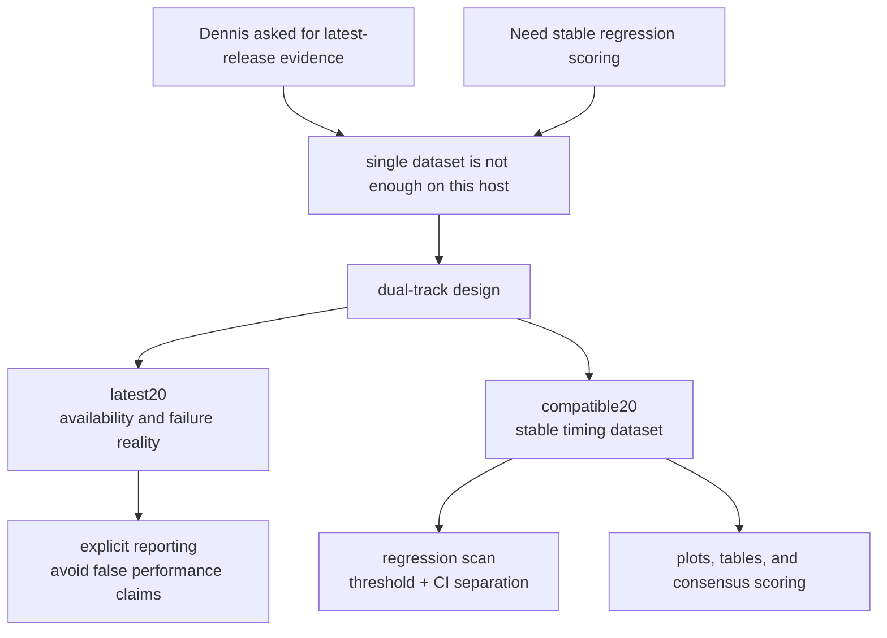

# Engineering Notes

This note explains why the repo is shaped the way it is, not just what commands it runs.

## Decision Topology

## Problem Framing

The project needs latest-release visibility and a reliable regression signal at the same time. On this host, those goals conflict if they are treated as a single dataset.

## Alternatives Considered

- Single `latest20` dataset only:
  - Pro: It matches the original wording closely.
  - Con: Compatibility failures can dominate the results and reduce the regression signal.
- Single compatible-only dataset:
  - Pro: It gives a clean regression dataset.
  - Con: It weakens alignment with the "latest 20 releases" requirement.
- Dual-track dataset (selected):
  - Pro: It preserves literal latest-release evidence and a stable regression dataset.
  - Con: It requires clear reporting so readers do not confuse availability with performance.

## Data And Metric Decisions

- Warmups are excluded from scoring but retained in the raw logs.
- Regression detection uses a threshold plus confidence-interval separation to reduce false positives.
- `-c` compile mode is used to isolate compiler behavior from linker and runtime mismatch noise.
- Artifact size is labeled as object size so the repo does not overclaim final binary-size meaning.
- The switch-scaling experiment keeps the harness logic stable and changes only the generated switch width.
- The D-native CLI now mirrors the core analyze, trace, switch-scale, and native not-done paths, so the repo is less dependent on Python-only orchestration.

## Current Verification Notes

- The benchmark suite now compiles cleanly with DMD `v2.112.0` after fixing the benchmark sources in `benchmarks/d/`.
- `dmdbench not-done --list-tasks` and `dmdbench sweep --track compatible20` were fixed so the D-native CLI behaves consistently during smoke runs.
- `dub` workflows are reproducible in restricted environments when `DUB_HOME=.tmp-dub-home` is set.

## Remaining Risks

- The `latest20` track can still fail when release binaries are incompatible with the host runtime.
- Trace-granularity recommendations can vary with benchmark shape and machine load.
- The switch-scaling curve remains sensitive to code shape, so follow-up variants may still be needed before making broad upstream claims.
- The make-target matrix uses aggressive per-target caps, so timeouts in that matrix do not always mean a command is broken.
