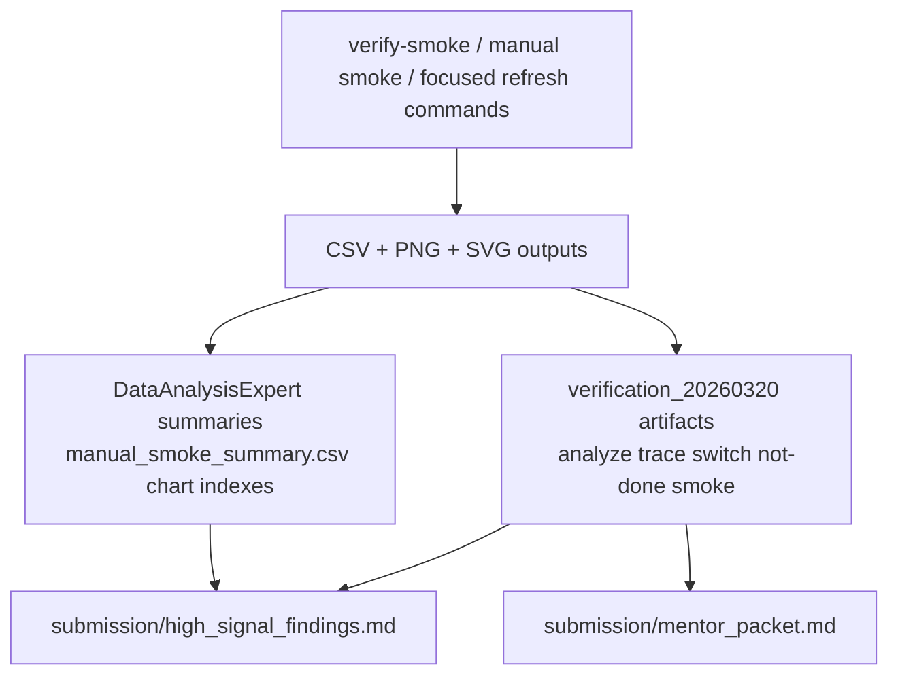

# Evidence Packet

Start here if you want the quickest path from command to evidence file.

## Evidence Flow



## Verification Smoke Pack (2026-03-20)

These artifacts came from the current command-review pass and are the best entry point for understanding what now works end to end.

- Manual smoke summary:
  - `DataAnalysisExpert/manual_smoke_summary.csv`
- Manual smoke chart index:
  - `DataAnalysisExpert/manual_smoke_chart_index.md`
- D-native analyze smoke:
  - `artifacts/verification_20260320/dmdbench_analyze/report.md`
  - `artifacts/verification_20260320/dmdbench_analyze/compile_time_trend.svg`
  - `artifacts/verification_20260320/dmdbench_analyze/artifact_size_trend.svg`
- Trace smoke:
  - `artifacts/verification_20260320/run_trace/trace_phase_summary.csv`
  - `artifacts/verification_20260320/run_trace/trace_phase_bar.png`
- Switch-scaling smoke:
  - `artifacts/verification_20260320/dmdbench_switch/summary.csv`
  - `artifacts/verification_20260320/python_switch/results_summary.csv`
  - `artifacts/verification_20260320/python_switch/compile_time_vs_cases.png`
- Compatible-track sweep smoke:
  - `artifacts/verification_20260320/bench_smoke/results_raw.csv`
- Native not-done smoke:
  - `artifacts/verification_20260320/dmdbench_not_done_native/status.csv`
  - `artifacts/verification_20260320/dmdbench_zero_cost_smoke/status.csv`

Refresh commands:

```bash
export DUB_HOME="$PWD/.tmp-dub-home"
mkdir -p "$DUB_HOME"

python3 DataAnalysisExpert/generate_command_charts.py \
  --summary DataAnalysisExpert/manual_smoke_summary.csv \
  --out-dir DataAnalysisExpert \
  --prefix manual_smoke

./.locald/dmd-nightly/osx/bin/dmd benchmark.d -of=/tmp/benchmark_smoke && /tmp/benchmark_smoke

(cd tools/dmdbench && ../../.locald/dmd-nightly/osx/bin/dub build)
./tools/dmdbench/bin/dmdbench analyze --input-dir artifacts --tracks latest20,compatible20 --out-dir artifacts/verification_20260320/dmdbench_analyze
./tools/dmdbench/bin/dmdbench trace --dmd-bin ./.locald/dmd-nightly/osx/bin/dmd --benchmark benchmark.d --out-dir artifacts/verification_20260320/dmdbench_trace --granularity 10 --granularity-sweep 10,50
./tools/dmdbench/bin/dmdbench not-done --list-tasks
./tools/dmdbench/bin/dmdbench not-done --native --tasks zero_cost --zero-cost-runs 1 --zero-cost-warmups 0 --zero-cost-iters 1 --out-dir artifacts/verification_20260320/dmdbench_zero_cost_smoke
./bench_releases.sh --track compatible20 --runs 1 --warmups 0 --timeout-sec 30 --track-out-dir artifacts/verification_20260320/bench_smoke
```

## Parser-Threading Prototype

- Comparison table:
  - `artifacts/upgrades/parser_thread_compare_narrow/comparison.csv`
- Baseline status:
  - `artifacts/upgrades/parser_thread_compare_narrow/baseline/status.csv`
- Threaded status:
  - `artifacts/upgrades/parser_thread_compare_narrow/threaded/status.csv`
- Threaded diagnostics:
  - `artifacts/upgrades/parser_thread_compare_narrow/threaded/parser_incompiler_parallel/diagnostics.csv`

Refresh command:

```bash
./parser_threading_compare.sh \
  --python-bin ./.venv/bin/python \
  --baseline-dmd ./.locald/dmd-nightly/osx/bin/dmd \
  --threaded-dmd ./external/dmd/generated/osx/debug/64/dmd \
  --threads 1,2,4 \
  --repeats 2 \
  --file-counts 64,128 \
  --diagnostics \
  --out-dir artifacts/upgrades/parser_thread_compare_narrow
```

Notes:

- Baseline runs use coarse lock mode.
- The threaded candidate runs in narrow lock mode unless it is explicitly changed.

## Runtime-Library Kernels

- Aggregate report:
  - `artifacts/upgrades/runtime_libs_smoke/runtime_libs_report.md`
- GC kernels:
  - `artifacts/upgrades/runtime_libs_smoke/gc_kernels/report.md`
- Associative-array kernels:
  - `artifacts/upgrades/runtime_libs_smoke/aa_kernels/report.md`
- Float-to-string kernels:
  - `artifacts/upgrades/runtime_libs_smoke/float_to_string_kernels/report.md`

Refresh command:

```bash
./.venv/bin/python ./not_done_experiments.py \
  --out-dir artifacts/upgrades/runtime_libs_smoke \
  --tasks gc_kernels,aa_kernels,float_to_string_kernels \
  --runtime-runs 2 \
  --runtime-warmups 1
```

## `dub` PGO

- Status CSV:
  - `artifacts/upgrades/runtime_libs_smoke/status.csv`
- Current host limitation:
  - `dub_pgo` is now cache-first. The default path reuses `artifacts/cache/dub_pgo/dlang__dub`, and explicit bootstrap is only needed when that cache is missing.

Refresh command:

```bash
./.venv/bin/python ./not_done_experiments.py \
  --out-dir artifacts/upgrades/runtime_libs_smoke \
  --tasks dub_pgo \
  --dub-pgo-runs 1 \
  --clone-timeout 20
```
