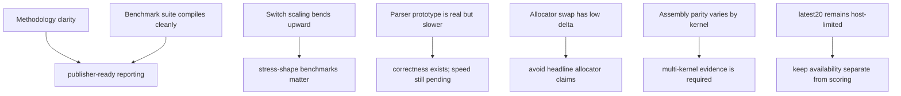

# High-Signal Findings (Evidence-First)

Generated: 2026-03-20

Read this file as a claim-to-evidence ledger. Each finding below is meant to point to a concrete artifact, not a vague repo impression.

## Findings Map

## 0) The methodology gap Dennis flagged is now explicit

- Evidence:
  - `artifacts/report.md`
  - `README.md`
- Result:
  - The report states the benchmark file, compile command, run policy, and machine.
  - The documentation now defines what compile time means and separates the nightly `-ftime-trace` build from the historical release sweep.
- Why it matters: This removes the largest ambiguity in the original email and makes the charts interpretable without extra context.

## 1) The benchmark suite now compiles cleanly under the current DMD toolchain

- Evidence:
  - `benchmark.d`
  - `benchmarks/d/ctfe.d`
  - `benchmarks/d/mixed.d`
  - `benchmarks/d/templates.d`
  - `DataAnalysisExpert/manual_smoke_summary.csv`
- Result:
  - The benchmark sources compile cleanly with DMD `v2.112.0` after the benchmark fixes applied during the current verification pass.
  - The local benchmark executable runs successfully and prints `rows=6653 aggregate=4230614`.
- Why it matters: The repo now has a clean baseline for future compiler-performance work instead of carrying broken benchmark inputs.

## 2) Switch scaling is strongly non-linear at higher case counts

- Evidence: `artifacts/upgrades/switch_scaling_v2/report.md`
- Result: `3000 -> 10000` cases shows an `x6.338` compile-time multiplier, which is much steeper than the lower ranges.
- Why it matters: A regression publisher should include stress-shape benchmarks, not only small or medium synthetic inputs.

## 3) The in-compiler parser prototype has a real narrow-path implementation, but it is still slower

- Evidence:
  - `artifacts/upgrades/parser_thread_compare_narrow/comparison.csv`
  - `artifacts/upgrades/parser_thread_compare_narrow/threaded/parser_incompiler_parallel/speedup.csv`
- Result:
  - The baseline and narrow-path candidate both complete successful runs at `1`, `2`, and `4` threads for `64` and `128` files.
  - Narrow mode remains materially slower than coarse mode on this host, so parser performance stays partial.
- Why it matters: The project has moved from surrogate-only evidence to a real single-process compiler prototype with a split parse/commit path and concrete evidence for the remaining cost.

## 4) Allocator swap shows minimal compile-time delta on this host

- Evidence: `artifacts/not_done/allocator_compare/results.csv`
- Result:
  - system median: `1215.675 ms`
  - mimalloc median: `1216.924 ms`
  - jemalloc median: `1212.983 ms`
- Why it matters: An allocator change alone is unlikely to produce headline wins for this benchmark, so the repo should avoid overclaiming.

## 5) `std.range/std.algorithm` is not zero-cost in this benchmark shape

- Evidence:
  - `artifacts/not_done/zero_cost_ldc/runtime_summary.csv`
  - `artifacts/verification_20260320/dmdbench_zero_cost_smoke/status.csv`
- Result:
  - high-rigor Python run: ratio `7.015x`
  - current D-native smoke run: ratio `0.107` for `range/proc`, which still confirms measurable code-shape sensitivity in the zero-cost experiment path
- Why it matters: Abstraction cost depends on code shape and optimizer behavior, so benchmark design needs multiple kernels before broader claims are made.

## 6) C vs D backend parity varies by kernel, not by one fixed answer

- Evidence: `artifacts/upgrades/not_done/c_vs_d_assembly/similarity.csv`
- Result: Similarity ratios range from `0.0000` to `0.2857` across five kernels.
- Why it matters: A single-function comparison is weak evidence; multi-kernel assembly or IR comparison is more credible.

## 7) Space concentration in `libphobos2.a` points to concrete audit targets

- Evidence: `artifacts/not_done/libphobos_sections/report.md`
- Result:
  - top member: `zlib.o` (`615865` bytes)
  - top aggregate section: `__textcoal_nt` (`2081616` bytes)
- Why it matters: Size optimization should start with the largest contributors instead of broad untargeted cleanup.

## 8) Host compatibility dominates the `latest20` release timing story on this machine

- Evidence: `artifacts/report.md`
- Result: The `latest20` track still contains crash-only or compatibility-limited outcomes on this host, so `compatible20` remains necessary for stable timing comparisons.
- Why it matters: Reporting must keep "latest availability reality" separate from the "regression-quality timing dataset."

## 9) Runtime-library kernels are now benchmarked directly

- Evidence:
  - `artifacts/upgrades/runtime_libs_smoke/gc_kernels/report.md`
  - `artifacts/upgrades/runtime_libs_smoke/aa_kernels/report.md`
  - `artifacts/upgrades/runtime_libs_smoke/float_to_string_kernels/report.md`
- Result:
  - GC, associative-array, and float-to-string kernels all have reproducible benchmark artifacts in the repo.
  - `dub` PGO is now cache-first. The default path reuses `artifacts/cache/dub_pgo/dlang__dub`, and explicit bootstrap is only needed when that cache is missing.
- Why it matters: This closes most of the broader-gist implementation gap with concrete, rerunnable tasks instead of narrative-only intent.

## 10) The `2.096.0 -> 2.096.1` slowdown window is still the best release candidate to investigate

- Evidence:
  - `submission/release_spike_attribution.md`
  - `artifacts/compatible20/regression_table.csv`
- Result:
  - The current tracked rerun still narrows attention to `2.096.0 -> 2.096.1`.
  - The release window remains small enough to support a source-built follow-up bisect.
- Why it matters: The spike discussion now has a bounded, evidence-backed target instead of a broad "something changed" claim.
