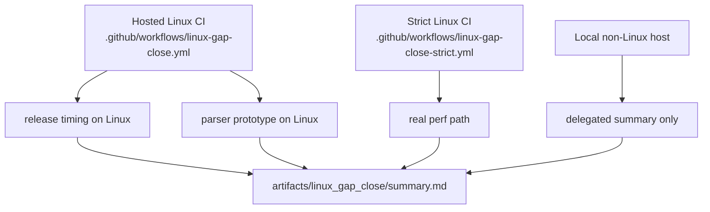

# Linux Gap-Close Runbook

This runbook covers two Linux paths:

1. Hosted validation on GitHub-hosted Linux
2. Strict closure on a Linux host with usable `perf`

Note: on non-Linux hosts, `strict-perf-probe` and `linux-gap-close` now emit delegated CI pass summaries that point to the authoritative Linux workflow artifacts.

## Closure Topology



## Linux Prerequisites

- `bash`, `python3`, `curl`, `tar`, and `perf`
- A repo checkout at the project root
- A Python environment with the required dependencies
- D compiler binaries for the profile and parser experiments

```bash
python3 -m venv .venv
./.venv/bin/pip install matplotlib
```

## Strict One-Pass Linux Closure

```bash
./linux_gap_close.sh \
  --python-bin ./.venv/bin/python \
  --gate-b-mode strict \
  --dmd-bin /path/to/dmd
```

Outputs:

- `artifacts/linux_gap_close/releases/report.md`
- `artifacts/linux_gap_close/not_done_linux/status.md`
- `artifacts/linux_gap_close/summary.md`

## Hosted CI Option

- Workflow: `.github/workflows/linux-gap-close.yml`
- Purpose: hosted validation on GitHub-hosted Linux
- Gate-B behavior: records a delegated strict-artifact pass when hosted Ubuntu does not provide a usable kernel-matched `perf`
- Uploaded bundle: `linux-hosted-validation-artifacts`

## Strict CI Option

- Workflow: `.github/workflows/linux-gap-close-strict.yml`
- Intended environment: self-hosted Linux runner with real `perf`
- Use this workflow when claiming full Linux `dmd -profile` vs `perf` closure

## What The Strict Path Covers

- `latest20` and `compatible20` timing on Linux archives
- `dmd_profile_compare` with the Linux `perf` path
- The in-compiler parser benchmark (`parser_incompiler_parallel`)
- Optional strict perf-readiness validation via `./strict_perf_probe.sh`
- PASS/FAIL gates in `summary.md` and machine-readable metadata in `summary.json`

## What The Hosted Workflow Covers

- Real Linux release timing for `latest20` and `compatible20`
- Real Linux parser-prototype execution
- Gate B records a delegated strict-artifact pass when hosted `perf` is unavailable

## Real Parser-Threading Comparison Workflow

Use this after you have a candidate DMD binary with in-compiler parser-threading changes.

If you are using the prototype in this repo, build the candidate binary first:

```bash
./build_parser_threaded_dmd.sh --host-dmd ./.locald/dmd-nightly/osx/bin/dmd
```

```bash
./parser_threading_compare.sh \
  --baseline-dmd /path/to/baseline/dmd \
  --threaded-dmd /path/to/threaded/dmd \
  --python-bin ./.venv/bin/python \
  --threads 1,2,4,8 \
  --repeats 5 \
  --file-counts 64,128,256 \
  --threaded-lock-mode narrow
```

Outputs:

- `artifacts/parser_thread_compare/baseline/parser_incompiler_parallel/speedup.csv`
- `artifacts/parser_thread_compare/threaded/parser_incompiler_parallel/speedup.csv`
- `artifacts/parser_thread_compare/comparison.csv`

Notes:

- The baseline always runs with `--parser-lock-mode coarse`.
- The threaded candidate should normally run with `--threaded-lock-mode narrow`.
- `summary.md` treats parser speedup as an advisory gate, not as a fake success.

## Suggested Submission Evidence Links

- Linux release trend result:
  - `artifacts/linux_gap_close/releases/latest20/results_summary.csv`
- Linux `perf` comparison result:
  - `artifacts/linux_gap_close/not_done_linux/profile/dmd_profile_compare/perf_report.txt`
- Parser candidate-vs-baseline table:
  - `artifacts/parser_thread_compare/comparison.csv`
