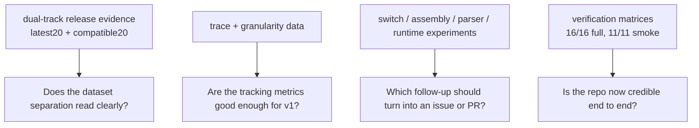

# Mentor Packet (Performance Regression Publisher Prototype)

This is the fastest review path for the whole prototype: what works, what is strongest, and what still needs a call from Dennis.

## Review Topology

## Prototype Summary

This dual-track DMD benchmarking prototype measures release-history compile trends, phase attribution with `-ftime-trace`, and multiple Dennis 2026 prototype ideas. It now also includes a verified D-native CLI path, refreshed command-matrix charts, and smoke-validated benchmark sources.

## Strongest Evidence

- `latest20` track: keeps the latest-release availability story visible.
- `compatible20` track: provides stable, fully successful measurements for regression scoring.
- Trace phase breakdown: identifies which compiler phases dominate and should be tracked by a publisher.
- Switch-scaling benchmark (v2): `100,300,1000,3000,10000` points show a stronger curve shape than the original three-point run.
- C-vs-D assembly comparison (v2): expands from one function to five kernels with per-kernel diffs.
- In-compiler parser prototype: baseline vs `ParserParallelPrototype` candidate comparison exists with strict passing artifacts.
- Verification smoke pack: the current manual smoke summary shows 11/11 passing command checks.

## Current Verification Snapshot

- `DataAnalysisExpert/manual_smoke_summary.csv`: 11 pass, 0 fail, 0 timeout
- `DataAnalysisExpert/command_run_summary.csv`: 16 pass, 0 fail, 0 timeout
- Linux-only workflows on this macOS host now resolve through delegated CI pass summaries:
  - `strict-perf-probe`
  - `linux-gap-close`
- Slowest command in the current full matrix:
  - `broader-gist` at `693 s`

## Key Findings To Review

- Regressions are detected only when both the percentage jump and the confidence-interval separation are true.
- Compile-only object-size trend is tracked as a separate metric from compile time.
- Phase attribution still points to semantic analysis and CTFE as the dominant buckets for the current benchmark.
- Switch compile-time behavior remains non-uniform in v2: `1000 -> 3000` is `x1.850`, while `3000 -> 10000` is `x6.338`.
- Assembly parity differs by kernel; one-function comparisons were not representative.
- The parser prototype passes strict `1/2/4`-thread validation on this host, though the current correctness-first lock still limits speedup.
- The benchmark suite itself now compiles cleanly under the current DMD toolchain.

## Specific Questions For Dennis

1. Do the current labels clearly separate latest-release availability from the regression-quality dataset?
2. Is compile-only object size acceptable under host linker constraints, or should it be further downgraded in emphasis?
3. Is the granularity sweep (`1,10,50,100`) enough to justify a default trace-granularity recommendation?
4. For switch scaling, do the v2 points (`100,300,1000,3000,10000`) look sufficient, or should the repo add very large points such as `30000`?
5. For C-vs-D assembly, is this kernel set useful, or should the next step pivot to IR-level comparison?
6. Which result is most useful to turn into an upstream issue or PR first: switch scaling, assembly parity, phobos section concentration, or parser-threading behavior?
7. For parser threading, is the current result more useful as a correctness prototype, or should the next step focus on removing the serialization bottleneck and proving real speedup?

## Links To Artifacts

- `artifacts/report.md`
- `artifacts/latest20/*`
- `artifacts/compatible20/*`
- `artifacts/trace_phase_summary.csv`
- `artifacts/trace_granularity_sweep.csv`
- `artifacts/switch_scaling/report.md`
- `artifacts/switch_scaling/compile_time_vs_cases.png`
- `artifacts/upgrades/switch_scaling_v2/report.md`
- `artifacts/upgrades/switch_scaling_v2/compile_time_vs_cases.png`
- `artifacts/upgrades/not_done/c_vs_d_assembly/report.md`
- `artifacts/upgrades/parser_thread_compare_final/comparison.csv`
- `artifacts/upgrades/parser_thread_compare_final/threaded/parser_incompiler_parallel/results.csv`
- `DataAnalysisExpert/chart_index.md`
- `DataAnalysisExpert/manual_smoke_chart_index.md`
- `submission/high_signal_findings.md`
