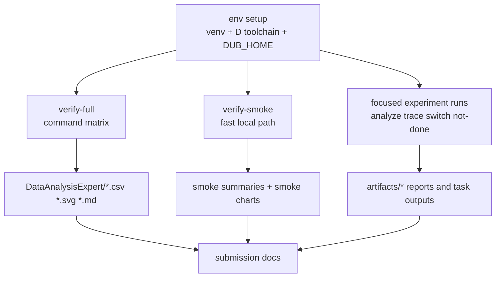

# Reproducibility Manifest

Generated: 2026-03-20

This is the operational map for rerunning the repo without guessing which command feeds which artifact.

## Reproducibility Topology



## Environment Snapshot

- Python: `3.14.2`
- DMD: `v2.112.0`
- LDC: `1.42.0` (LLVM `21.1.8`)
- Clang: `17.0.0`
- Platform: `macOS-26.2-arm64-arm-64bit-Mach-O`

Reference manifests:

- `artifacts/not_done/manifest.json`
- `artifacts/upgrades/not_done/manifest.json`
- `artifacts/verification_20260320/dmdbench_not_done_native/manifest.json`

## Local `dub` Setup For Restricted Environments

Some `dub` operations need a writable local home when the default cache location is not usable.

```bash
export DUB_HOME="$PWD/.tmp-dub-home"
mkdir -p "$DUB_HOME"
```

## Command Matrix (Make Targets)

```bash
bash DataAnalysisExpert/run_make_matrix.sh
python3 DataAnalysisExpert/generate_command_charts.py \
  --summary DataAnalysisExpert/command_run_summary.csv \
  --out-dir DataAnalysisExpert
```

Outputs:

- `DataAnalysisExpert/command_run_summary.csv`
- `DataAnalysisExpert/command_status_counts.svg`
- `DataAnalysisExpert/command_duration_by_target.svg`
- `DataAnalysisExpert/chart_index.md`
- `DataAnalysisExpert/full_status_counts.svg`
- `DataAnalysisExpert/full_duration_by_target.svg`
- `DataAnalysisExpert/full_chart_index.md`

Current 2026-03-20 result summary:

- 16 pass
- 0 fail
- 0 timeout
- Linux-only workflows on macOS now resolve through delegated CI pass summaries for `strict-perf-probe` and `linux-gap-close`
- Slowest command in the current full matrix: `broader-gist` at `693 s`

## Manual Smoke Matrix

```bash
python3 DataAnalysisExpert/generate_command_charts.py \
  --summary DataAnalysisExpert/manual_smoke_summary.csv \
  --out-dir DataAnalysisExpert \
  --prefix manual_smoke
```

Outputs:

- `DataAnalysisExpert/manual_smoke_summary.csv`
- `DataAnalysisExpert/manual_smoke_status_counts.svg`
- `DataAnalysisExpert/manual_smoke_duration_by_target.svg`
- `DataAnalysisExpert/manual_smoke_chart_index.md`

Current 2026-03-20 result summary:

- 11 pass
- 0 fail
- 0 timeout

## Verification Smoke Commands

```bash
./.locald/dmd-nightly/osx/bin/dmd benchmark.d -of=/tmp/benchmark_smoke && /tmp/benchmark_smoke

(cd tools/dmdbench && ../../.locald/dmd-nightly/osx/bin/dub build)

./.locald/dmd-nightly/osx/bin/dub test --root=benchmarks/dub_pgo_workspace/packages/alpha benchmarks/dub_pgo_workspace/packages/alpha
./.locald/dmd-nightly/osx/bin/dub test --root=benchmarks/dub_pgo_workspace/packages/beta benchmarks/dub_pgo_workspace/packages/beta
./.locald/dmd-nightly/osx/bin/dub test --root=benchmarks/dub_pgo_workspace/packages/gamma benchmarks/dub_pgo_workspace/packages/gamma
./.locald/dmd-nightly/osx/bin/dub test --root=benchmarks/dub_pgo_workspace/packages/delta benchmarks/dub_pgo_workspace/packages/delta
./.locald/dmd-nightly/osx/bin/dub test --root=benchmarks/dub_pgo_workspace benchmarks/dub_pgo_workspace

./tools/dmdbench/bin/dmdbench analyze --input-dir artifacts --tracks latest20,compatible20 --out-dir artifacts/verification_20260320/dmdbench_analyze
./tools/dmdbench/bin/dmdbench trace --dmd-bin ./.locald/dmd-nightly/osx/bin/dmd --benchmark benchmark.d --out-dir artifacts/verification_20260320/dmdbench_trace --granularity 10 --granularity-sweep 10,50
./tools/dmdbench/bin/dmdbench switch-scale --compiler ./.locald/dmd-nightly/osx/bin/dmd --case-counts 10,100 --runs 1 --warmups 0 --out-dir artifacts/verification_20260320/dmdbench_switch
./tools/dmdbench/bin/dmdbench not-done --list-tasks
./tools/dmdbench/bin/dmdbench not-done --native --tasks zero_cost --zero-cost-runs 1 --zero-cost-warmups 0 --zero-cost-iters 1 --out-dir artifacts/verification_20260320/dmdbench_zero_cost_smoke

./.venv/bin/python ./analyze_results.py --input-dir artifacts --tracks latest20,compatible20 --out-dir artifacts/verification_20260320/python_analyze
./run_trace.sh --python-bin ./.venv/bin/python --dmd-bin ./.locald/dmd-nightly/osx/bin/dmd --out-dir artifacts/verification_20260320/run_trace --granularity 10 --granularity-sweep 10,50
./.venv/bin/python ./switch_case_experiment.py --compiler ./.locald/dmd-nightly/osx/bin/dmd --case-counts 10,100 --runs 1 --warmups 0 --out-dir artifacts/verification_20260320/python_switch
./.venv/bin/python ./not_done_experiments.py --out-dir artifacts/verification_20260320/python_not_done_runtime --phase runtime_libs --runtime-runs 1 --runtime-warmups 0

./bench_releases.sh --track compatible20 --runs 1 --warmups 0 --timeout-sec 30 --track-out-dir artifacts/verification_20260320/bench_smoke
```

## Canonical High-Rigor Run (Python)

```bash
./.venv/bin/python ./not_done_experiments.py \
  --out-dir artifacts/not_done \
  --phase all \
  --max-rigor \
  --ast-seeds 1,2,3 \
  --task-timeout 900 \
  --clone-timeout 1800 \
  --build-timeout 7200
```

Outputs:

- `artifacts/not_done/status.md`
- `artifacts/not_done/status.csv`
- `artifacts/not_done/manifest.json`

## Upgraded Switch-Scaling Run (Python)

```bash
./.venv/bin/python ./switch_case_experiment.py \
  --compiler ./.locald/dmd-nightly/osx/bin/dmd \
  --case-counts 100,300,1000,3000,10000 \
  --runs 9 \
  --warmups 3 \
  --out-dir artifacts/upgrades/switch_scaling_v2
```

Outputs:

- `artifacts/upgrades/switch_scaling_v2/report.md`
- `artifacts/upgrades/switch_scaling_v2/results_summary.csv`
- `artifacts/upgrades/switch_scaling_v2/compile_time_vs_cases.png`

## Upgraded C-vs-D Multi-Kernel Assembly Run (Python)

```bash
./.venv/bin/python ./not_done_experiments.py \
  --out-dir artifacts/upgrades/not_done \
  --tasks c_vs_d_asm
```

Outputs:

- `artifacts/upgrades/not_done/c_vs_d_assembly/report.md`
- `artifacts/upgrades/not_done/c_vs_d_assembly/similarity.csv`
- `artifacts/upgrades/not_done/c_vs_d_assembly/*_instruction_diff.txt`

## In-Compiler Parser-Threading Prototype Run

```bash
# 1) Build the threaded prototype compiler binary
./build_parser_threaded_dmd.sh --host-dmd ./.locald/dmd-nightly/osx/bin/dmd

# 2) Compare baseline vs threaded parser behavior
./parser_threading_compare.sh \
  --python-bin ./.venv/bin/python \
  --baseline-dmd ./external/dmd/generated/osx/release/64/dmd \
  --threaded-dmd ./external/dmd/generated/osx/debug/64/dmd \
  --threads 1,2,4 \
  --repeats 3 \
  --file-count 64 \
  --out-dir artifacts/upgrades/parser_thread_compare_final
```

`build_parser_threaded_dmd.sh` now auto-prepares `external/dmd` at pinned upstream commit `4faeee39cf33c1e3491b7e1da83a71111f05606f` and then applies `patches/external_dmd_parser_parallel_prototype.patch`, so the prototype source base is reproducible instead of tracking moving upstream `master`.

Outputs:

- `artifacts/upgrades/parser_thread_compare_final/comparison.csv`
- `artifacts/upgrades/parser_thread_compare_final/baseline/parser_incompiler_parallel/results.csv`
- `artifacts/upgrades/parser_thread_compare_final/threaded/parser_incompiler_parallel/results.csv`

## Known Host-Limited Gaps

- Linux `perf` comparison is not reproducible on this macOS-only environment.
- `latest20` as a fully successful timing trend is host-compatibility limited here.
- `latest20` is snapshot-first by default. `versions_latest20.txt` is the offline source of truth, and explicit refresh is now a maintenance action.

## D-First CLI Equivalents (Subset)

```bash
make dmdbench-build
./tools/dmdbench/bin/dmdbench sweep --track compatible20
./tools/dmdbench/bin/dmdbench analyze --input-dir artifacts --tracks latest20,compatible20 --out-dir artifacts
./tools/dmdbench/bin/dmdbench trace --dmd-bin ./.locald/dmd-nightly/osx/bin/dmd --granularity 1 --granularity-sweep 1,10,50,100
./tools/dmdbench/bin/dmdbench not-done --list-tasks
```
